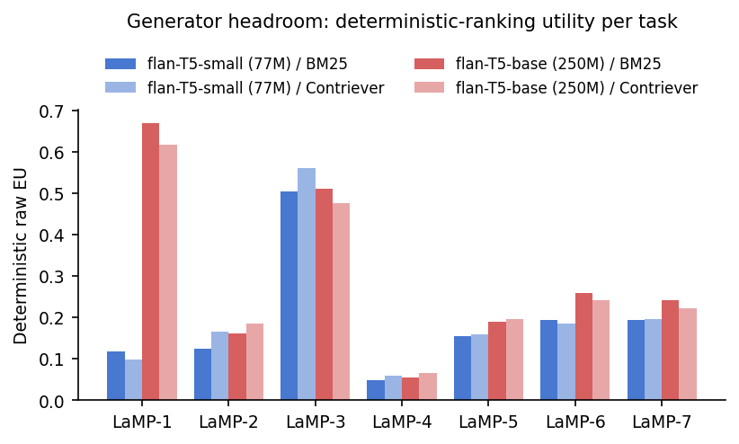
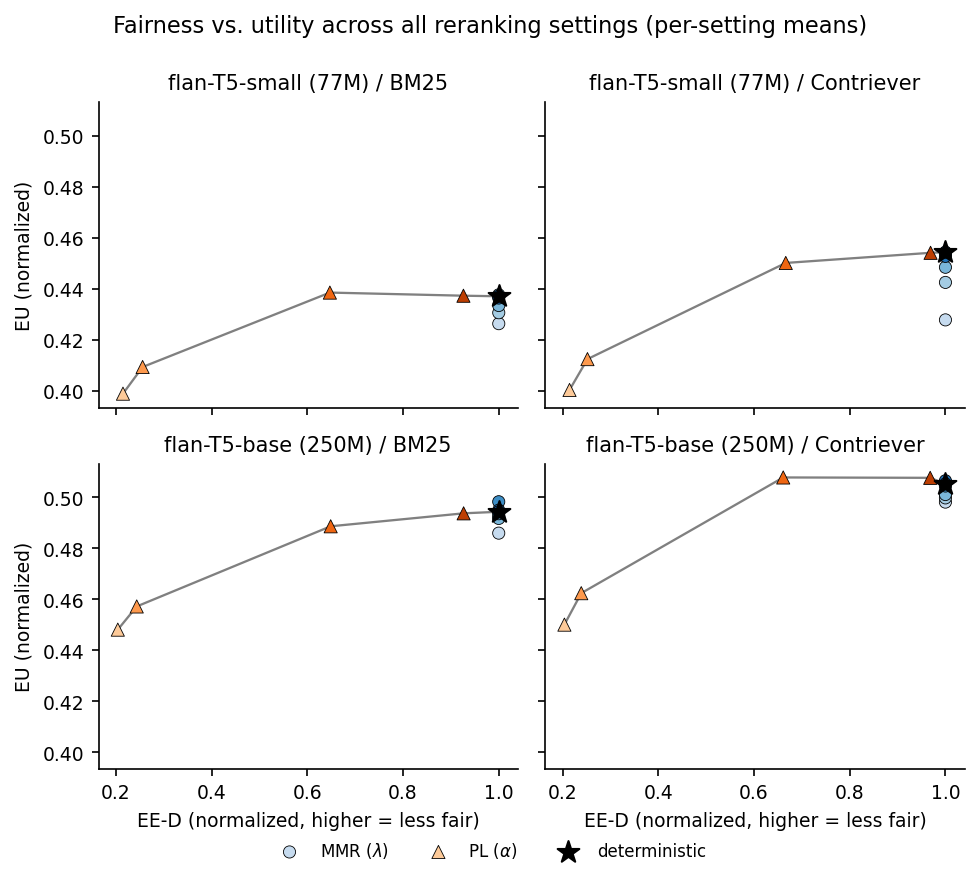
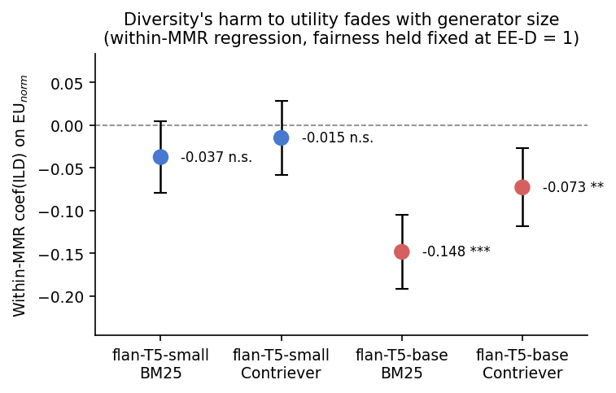
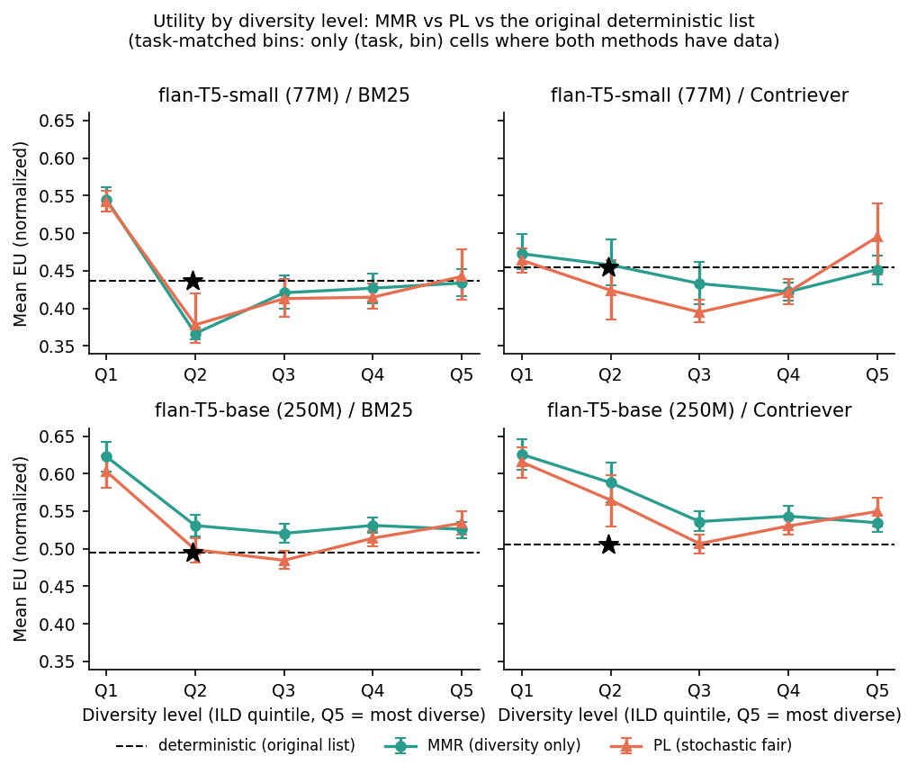

# Fair Ranking in RAG: Is the Benefit Fairness, or Diversity in Disguise?

*Working draft for content review — plain text, no LaTeX yet.*
*Idan Peretz, Avi Simkin.*

---

## The question this project set out to answer

The source paper this project extends reports that RAG systems built on
fair, item-exposure-equalizing rankings can match — and sometimes beat —
the generation quality of systems ranked purely by relevance, despite the
usual expectation that enforcing fairness costs ranking quality.

We didn't take that at face value. The specific fairness mechanisms that
tend to get used in practice (stochastic reranking that equalizes exposure,
for instance) don't just make rankings fairer — as a side effect, they also
tend to make the *set of retrieved documents more varied*. If a RAG
generator benefits from seeing more varied context, any observed "fairness
helped" result could really be that variety doing the work, with fairness
just along for the ride. So before believing fairness itself helps, you
have to first rule out that its usual side effect — diversity — is the real
cause.

That's the question this project asks: **when a fair ranking method seems
to help (or hurt) a RAG system's output quality, is that fairness, or is it
the diversity that fairness happens to produce?**

## Why this is hard to test directly

Most fairness mechanisms don't give you a clean way to ask this. Plackett-
Luce (PL) reranking — the stochastic method we use to instantiate item-
exposure fairness — achieves fairness by randomizing selection probability
across relevant items, and that randomization mechanically increases how
different the shown items are from each other. Fairness (lower expected
exposure disparity) and diversity (higher intra-list Jaccard distance) rise
and fall together under PL by construction. You cannot separate them from
PL alone.

What breaks the coupling is Maximal Marginal Relevance (MMR): a reranking
method with an explicit relevance-vs-diversity dial and *no fairness
objective whatsoever*. Comparing PL to MMR **at matched diversity levels**
isolates whatever PL's fairness mechanism contributes beyond diversity —
which is the whole experiment in one sentence.

## Setup

LaMP benchmark, all 7 tasks, "user" split, full available queries per task
(not a subsample — see table). Two generators (Flan-T5-Small, 77M; Flan-
T5-Base, 250M), two retrievers (BM25, Contriever), 12 rerank settings per
(generator, retriever) cell: 1 relevance-only baseline, MMR at 7 diversity
levels (λ = 0.15–1.0), PL at 4 fairness strengths (α = 1, 2, 4, 8; 10
samples each). Fairness measured as Expected Exposure disparity (EE-D,
lower = fairer); generation quality as Expected Utility (EU — task-specific:
accuracy for LaMP-1/2, MAE for LaMP-3, ROUGE-L for LaMP-4–7); diversity as
ILD-Jaccard (1 − mean pairwise similarity of retrieved profile text).

| LaMP task | flanT5Base queries | flanT5Small queries |
|---|---|---|
| 1 | 232 | 51 |
| 2 | 280 | 192 |
| 3 | 378 | 311 |
| 4 | 827 | 833 |
| 5 | 759 | 826 |
| 6 | 783 | 760 |
| 7 | 211 | 365 |

336 total experiment runs, ~163,000 query-level observations.

## Finding 1 — Fairness essentially doesn't pay off

*fig1 — deterministic-baseline generation quality per task, establishing
how much headroom exists for reranking to move.*

Testing each fair setting against the relevance-only baseline (paired,
per-query, Holm-corrected within each cell) across all four (generator,
retriever) cells: **13 of 24 comparisons are statistically significant, and
11 of those are losses.** Two are gains — both the same PL configuration
(α=4) in two different cells — but tiny (+0.0014 and +0.0025 in normalized
EU, against losses an order of magnitude larger elsewhere). The picture is
not "fairness sometimes wins big" — it's "fairness is usually neutral-to-
costly, with a couple of statistically real but practically negligible
exceptions." This does not support the source paper's claim that fair
rankings often outperform relevance-only ranking.

## Finding 2 — There's a real, robust fairness-utility tradeoff

*fig2 — EE-D vs. EU per setting, PL path traced across α, one panel per
cell.*

Regressing normalized EU on EE-D across every observation: **coefficient
= +0.0533 (p = 1.6×10⁻⁸⁸, n = 157,704)**. Positive means less fairness →
more utility, i.e. pursuing fairness costs something. Drop any one of the 7
LaMP tasks and re-run the regression: the coefficient stays positive and
significant every time (range +0.044 to +0.060). This isn't an artifact of
any single task's data — it holds everywhere we look.

## Finding 3 — Diversity by itself is not the missing benefit

If diversity were secretly what makes fairness look good, diversity should
help on its own, holding fairness constant. It doesn't.

*fig4 — within-MMR (fairness held at zero — MMR has no fairness mechanism)
regression of EU on ILD, per cell.*

Pooled: **coefficient = −0.0675 (p = 5.6×10⁻¹⁰, n = 91,994).** More
diversity, slightly *worse* generation quality, on average. Leave any one
task out and the effect stays negative and significant in every case
(−0.042 to −0.134) — a genuinely task-independent result, not one riding on
a single benchmark's quirks. (Two individual tasks — LaMP-2 and LaMP-5 —
buck the pooled trend on their own; we show this per-task split rather than
hide it, since it's a real feature of the data, not noise to average away.)

So diversity is not a hidden source of benefit fairness could be borrowing
from. If anything it's a mild net negative in its own right.

## Finding 4 — Fairness's own mechanism carries a cost diversity doesn't explain

This is where the experiment answers the research question directly. Take
only the PL and MMR rows, control for diversity level, and ask whether
*being PL* (i.e., using the fairness mechanism, not just landing at some
diversity level) predicts a further utility difference.

*fig7 — EU by diversity level, PL vs. MMR, matched.*

| Cell | PL's cost, net of diversity | p | n |
|---|---|---|---|
| flanT5Small / BM25 | −0.0130 | 1.1×10⁻⁴ | 35,288 |
| flanT5Small / Contriever | −0.0186 | 4.7×10⁻⁸ | 35,288 |
| flanT5Base / BM25 | −0.0226 | 8.2×10⁻¹¹ | 36,993 |
| flanT5Base / Contriever | −0.0227 | 1.3×10⁻¹⁰ | 36,993 |

All four cells: negative, significant, similar magnitude, and — leaving any
one task out — still negative and significant everywhere.

**Answer to the research question:** no, the effect is not diversity
wearing fairness's clothes. Even holding diversity fixed, using PL's
fairness mechanism specifically costs something extra. The likely
mechanism is not a diversity cost at all but a *relevance* cost — PL
samples away from the most-relevant item probabilistically, and that has a
direct generation-quality cost independent of how diverse the resulting
list happens to be.

## Robustness

Every coefficient above (Findings 2, 3, 4) was checked leave-one-task-out
across all 7 LaMP tasks and survives every single drop. That's a stronger
robustness picture than earlier passes at this analysis achieved on a
smaller query sample, where the diversity finding specifically depended on
keeping one particular task in the data. With the full dataset, none of
the three headline findings depend on any single task.

## What we can't say

- **Scale.** Whether this tradeoff grows, shrinks, or reverses at generator
  scales beyond 250M parameters is untested — utility labels exist for a
  much larger (XXL) generator, but it doesn't fit the GPU available for
  this project. That's the natural next step, not something this data can
  answer.
- **Task dependence of the diversity effect.** Finding 3's pooled effect is
  robust, but two of seven tasks individually go the other way. We report
  this rather than paper over it — it suggests diversity's effect is
  benchmark-shaped, not a universal constant.
- **Open, unresolved:** an earlier pass at this analysis (on a much smaller
  query sample) claimed flanT5Base's baseline quality was several times
  flanT5Small's on some task, as evidence of a "floor effect." We have not
  yet re-derived this cleanly on the full dataset in a way that's
  apples-to-apples across tasks (LaMP's tasks use different metrics on
  different scales, so pooling them naively isn't valid) — flagging this as
  unresolved rather than restating an unverified number.

## Bottom line

Fair reranking, in this benchmark, mostly doesn't help and sometimes costs
a small but real and highly reproducible amount of generation quality.
That cost is not explained away by the diversity fair reranking happens to
introduce — diversity on its own is neutral-to-harmful, and fairness's
mechanism carries an additional cost specifically tied to *how* it achieves
fairness (randomized sampling), not to what it produces. The original
question — is an apparent fairness benefit really diversity — has a clear
answer here: **it isn't, because there's no fairness benefit to explain
away, and the mechanism that would have to be "secretly diversity" has its
own separate, measurable cost.**
